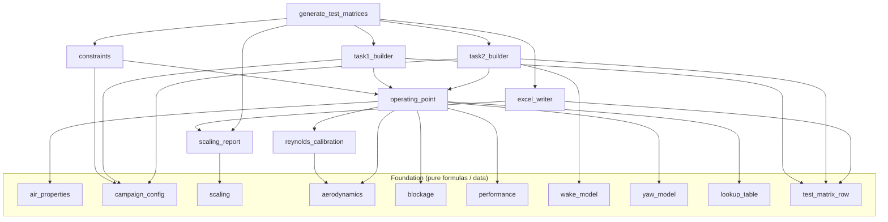
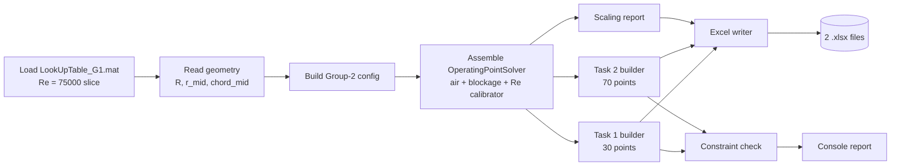

# wind-tunnel-testing
Repo for the course Wind Tunnel Testing of Windturbines at TUM in summer semester 26

## G1 Wind-Tunnel Test-Matrix Generator (Group 2)

> Automated generation of the **Task 1 (rotor performance)** and **Task 2 (wake survey)**
> Excel test matrices for the **G1** scaled wind-turbine model, for the TUM *Wind Tunnel
> Testing of Wind Turbines* lab course (WS 25/26).

This repository contains a small, strictly-modular Python package (`wtt/`) that turns the
G1 aerodynamic look-up table (`LookUpTable_G1.mat`) and a set of campaign requirements into
two ready-to-use `.xlsx` test matrices. Every operating point is derived from first
principles — Reynolds-number calibration, velocity-triangle aerodynamics, a yaw-dependent
performance model, wind-tunnel blockage correction, similarity scaling, and an analytical
wake-deflection model — so the numbers are traceable from the slides and papers straight
through to the spreadsheet cells.

The document is written for two audiences:

* **Software developers** — Sections [4](#4-software-architecture)–[5](#5-module-reference)
  describe the architecture, module responsibilities and public API.
* **Wind-tunnel engineers / report authors** — Section
  [7](#7-theoretical-background) is a self-contained theory chapter (formulas, assumptions,
  slide provenance) suitable for inclusion in a scientific report.

---

## Table of Contents

1. [Project Overview](#1-project-overview)
2. [Quick Start](#2-quick-start)
3. [Repository Layout](#3-repository-layout)
4. [Software Architecture](#4-software-architecture)
5. [Module Reference](#5-module-reference)
6. [Configuration & Inputs](#6-configuration--inputs)
7. [Theoretical Background](#7-theoretical-background)
8. [Test-Matrix Design](#8-test-matrix-design)
9. [Verification & Validation](#9-verification--validation)
10. [Assumptions, Limitations & Caveats](#10-assumptions-limitations--caveats)
11. [Nomenclature](#11-nomenclature)
12. [References](#12-references)

---

## 1. Project Overview

### 1.1 Purpose

Produce two spreadsheet **test matrices** that specify every operating point to dial in
during the wind-tunnel campaign and pre-compute the expected aerodynamic response, plus
blank columns for the channels the G1 model records.

### 1.2 Deliverables

| File | Task | Rows | Contents |
|------|------|------|----------|
| `Task1_Performance_TestMatrix_Group2.xlsx` | Performance | 30 | $C_P(\lambda)$ / $C_T(\lambda)$ curves at three yaw angles |
| `Task2_Wake_TestMatrix_Group2.xlsx` | Wake | 70 | Hub-height wake survey at one downstream station, three yaw angles |

Each workbook also carries a second sheet, **“Scaling (model-full)”**, listing the applied
model↔full-scale similarity factors.

### 1.3 Group-2 Scope

Group 2 measures at yaw angles $\gamma = 0^\circ,\,+30^\circ,\,-30^\circ$:

* **Performance:** three $C_P$/$C_T$ curves at $Re = 75\,000\ (\pm 2000)$, optimum blade
  pitch, **varying** TSR — 30 points total.
* **Wake:** wake shape at **one** downstream location, prescribed wind speed
  $U_\infty = 5.4\ \mathrm{m/s}$, optimum pitch and **optimum** TSR — 70 points total.

### 1.4 Hard Constraints (Group 2)

| Quantity | Limit |
|----------|-------|
| Tip-speed ratio $\lambda$ | $5.5 \le \lambda \le 9$ |
| Power $P$ | $0 \le P \le 75\ \mathrm{W}$ |
| Torque $Q$ | $0 \le Q \le 1\ \mathrm{Nm}$ |
| Rotor speed $N$ | $N \le 850\ \mathrm{rpm}$ |
| Reynolds number $Re$ | $75\,000 \pm 2000$ |

---

## 2. Quick Start

### 2.1 Requirements

* Python ≥ 3.10 (uses PEP 604 `X | None` typing)
* `numpy`, `scipy`, `openpyxl`

```powershell
pip install numpy scipy openpyxl
```

### 2.2 Run

From the repository root (where `LookUpTable_G1.mat` lives):

```powershell
python generate_test_matrices.py
```

The script prints a campaign summary, the scaling factors and a constraint-verification
report, then writes the two `.xlsx` files.

### 2.3 Expected Console Output (abridged)

```
=== Campaign summary (Group 2) ===
  Rotor diameter           : 1.0872 m
  Tip radius               : 0.5436 m
  Midspan radius (r/R=0.5) : 0.2765 m
  Midspan chord            : 0.0516 m
  Tunnel cross-section area: 4.8600 m^2
  Blockage ratio alpha     : 19.10 %
  Table optimum            : Cp=0.4063 at TSR=7.050, pitch=0.40 deg
...
=== Constraint check: Task 1 (performance) ===
  All rows satisfy the Group-2 constraints.
=== Constraint check: Task 2 (wake) ===
  All rows satisfy the Group-2 constraints.
```

---

## 3. Repository Layout

```
wind-tunnel-testing/
├── generate_test_matrices.py        # Entry point / pipeline orchestration
├── LookUpTable_G1.mat               # G1 aerodynamic look-up table (input)
├── Task1_Performance_TestMatrix_Group2.xlsx   # Output (generated)
├── Task2_Wake_TestMatrix_Group2.xlsx          # Output (generated)
└── wtt/                             # Package: one concept per module
    ├── __init__.py                  # Public exports
    ├── air_properties.py            # Air density & viscosity (ideal gas, 20 °C)
    ├── campaign_config.py           # Immutable configuration dataclasses
    ├── lookup_table.py              # .mat loader + coefficient interpolation
    ├── aerodynamics.py              # Velocity triangle, Reynolds, TSR↔rpm
    ├── blockage.py                  # Glauert wall-blockage correction
    ├── performance.py               # Dimensional power / thrust / torque
    ├── reynolds_calibration.py      # Solve U' for target Reynolds
    ├── scaling.py                   # Lecture-1 similarity scale factors
    ├── scaling_report.py            # Applies scaling to G1 ↔ full scale
    ├── wake_model.py                # Jiménez deflection + point distribution
    ├── yaw_model.py                 # Yaw cosine-loss + rotational asymmetry
    ├── operating_point.py           # Assembles the full physics chain
    ├── constraints.py               # Group-2 limit checks
    ├── test_matrix_row.py           # Row schema + measured-channel columns
    ├── task1_builder.py             # Builds the 30-row performance matrix
    ├── task2_builder.py             # Builds the 70-row wake matrix
    └── excel_writer.py              # Styled .xlsx writer (+ scaling sheet)
```

> **Note on the file name `campaign_config.py`:** a module literally named `config.py`
> is blocked by GitHub Copilot’s content-exclusion policy. The configuration module is
> therefore named `campaign_config.py`.

---

## 4. Software Architecture

### 4.1 Design Principles

The codebase follows four rules, in priority order:

1. **Strict separation of concerns.** Every physical formula lives in its own small,
   named function (e.g. `relative_velocity`, `glauert_speed_ratio`). A single equation
   can be inspected or corrected without touching anything else.
2. **Object-oriented composition.** Stateful collaborators (look-up table, calibrator,
   solver, builders, writer) are classes; pure formulas are free functions.
3. **Fail-fast, no fallbacks.** No default values are supplied for physically meaningful
   inputs and no silent error recovery exists. A missing value raises immediately; an
   out-of-range interpolation raises (`bounds_error=True`); a root that cannot be
   bracketed raises. Wrong numbers are never produced quietly.
4. **Simplicity over generality.** No abstractions are introduced for one-off operations.

### 4.2 Module Dependency Graph



### 4.3 Execution Pipeline



---

## 5. Module Reference

| Module | Key class / functions | Responsibility |
|--------|----------------------|----------------|
| `air_properties` | `AirProperties`, `air_density_ideal_gas`, `celsius_to_kelvin` | Air density (ideal-gas) and kinematic viscosity at the reference state |
| `campaign_config` | `CampaignConfig`, `build_group2_campaign`, `WindTunnelGeometry`, `Group2Constraints`, `WakeSurveySettings`, `YawSchedule`, `YawModelSettings` | Immutable campaign configuration; the single place where campaign numbers live |
| `lookup_table` | `G1LookUpTable`, `OptimumOperatingPoint` | Loads the `Re = 75000` slice; interpolates $C_P$, $C_T$, $C_Q$, $a$; geometry; optimum search |
| `aerodynamics` | `relative_velocity`, `reynolds_number`, `omega_from_tsr`, `rpm_from_omega`, `axial_velocity_component`, `tangential_velocity_component` | Velocity triangle, Reynolds definition, TSR↔ω↔rpm conversions |
| `blockage` | `blockage_ratio`, `glauert_speed_ratio`, `commanded_tunnel_speed`, `equivalent_free_air_speed` | Glauert wall-blockage correction |
| `performance` | `rotor_disk_area`, `aerodynamic_power`, `aerodynamic_thrust`, `aerodynamic_torque` | Coefficient → dimensional load conversion |
| `reynolds_calibration` | `ReynoldsCalibrator` | Root-solves the free-air speed that yields $Re = 75000$ at midspan |
| `scaling` | `length_scale`, `velocity_scale`, `power_scale`, `torque_scale`, `force_scale`, `bending_stiffness_scale`, `samsung_s7_reference` | Lecture-1 similarity scale factors |
| `scaling_report` | `ScalingReport`, `ScalingFactorRow` | Applies the scale factors to relate G1 ↔ Samsung S7.0-171 |
| `wake_model` | `initial_skew_angle`, `wake_center_offset`, `wake_radius`, `centered_lateral_positions`, `fitted_half_width` | Jiménez wake deflection; hub-height point distribution |
| `yaw_model` | `cosine_loss`, `advance_ratio`, `rotational_asymmetry_factor`, `YawPerformanceModel` | Yaw cosine-loss ($\cos^p\gamma$) and advancing/retreating sign asymmetry |
| `operating_point` | `OperatingPointSolver`, `OperatingPointResult`, `tangential_induction_from_torque` | Assembles the full physics chain for one $(\lambda, \beta, \gamma)$, including the yaw correction |
| `constraints` | `check_row` + per-limit predicates | Group-2 limit verification |
| `test_matrix_row` | `TestMatrixRow`, `G1_MEASUREMENT_COLUMNS` | Row schema and the blank measured-channel column names |
| `task1_builder` | `Task1PerformanceBuilder` | Builds the 30-row constant-$Re$ performance matrix |
| `task2_builder` | `Task2WakeBuilder` | Builds the 70-row wake matrix |
| `excel_writer` | `TestMatrixExcelWriter` | Writes a styled workbook with the matrix and the scaling sheet |

### 5.1 Core API Sketch

```python
from wtt.lookup_table import G1LookUpTable
from wtt.campaign_config import build_group2_campaign
# ... assemble solver (see generate_test_matrices.py: build_solver)

table  = G1LookUpTable("LookUpTable_G1.mat")        # Re = 75000 slice
config = build_group2_campaign("LookUpTable_G1.mat", table.rotor_diameter())

# One operating point, constant-Re path (Task 1):
res = solver.solve_for_target_reynolds(tsr=7.0, pitch_deg=0.0, yaw_deg=0.0,
                                       target_reynolds=75_000)
# res.requested_tunnel_speed, res.rotor_speed_rpm, res.cp, res.ct_thrust,
# res.power_w, res.thrust_n, res.torque_nm, res.reynolds ...

# One operating point, fixed-speed path (Task 2):
res = solver.solve_for_fixed_speed(tsr=7.05, pitch_deg=0.0, yaw_deg=30.0,
                                   free_air_speed=5.4)
```

---

## 6. Configuration & Inputs

All campaign numbers are defined once in `build_group2_campaign()`:

| Group | Field | Value | Source |
|-------|-------|-------|--------|
| Tunnel | `length × width × height` | $4.5 \times 2.7 \times 1.8\ \mathrm{m}$ | Task brief / slides |
| Targets | `target_reynolds` | $75\,000$ | Assignment |
| Targets | `target_tsr` | $7.05$ | Assignment |
| Targets | `optimum_pitch_deg` | $0.4^\circ$ (parameterised) | Assignment / table optimum |
| Wake | `free_stream_speed` | $5.4\ \mathrm{m/s}$ | Group-2 brief |
| Wake | `downstream_distance` | $3D = 3.262\ \mathrm{m}$ | Design choice |
| Wake | `wake_expansion_coefficient` $k_d$ | $0.07$ | Typical value |
| Wake | traverse limits | $0<X<3850$, $-1000<Y<1000$, $-700<Z<600\ \mathrm{mm}$ | Lecture 5 |
| Yaw | `yaw_angles_deg` | $(0, +30, -30)$ | Group-2 brief |
| Yaw model | `power_cosine_exponent` / `thrust_cosine_exponent` | $3.0$ / $2.0$ | Momentum theory (§7.9) |
| Yaw model | `rotational_asymmetry` $k_\gamma$ | $0.10$ (calibrate to data) | $\pm\gamma$ asymmetry (§7.9) |
| Task 1 | `performance_tsr_sweep_min/max` | $[6.0, 9.0]$ | Verified feasible band (§8.1) |

The **rotor diameter is not hard-coded** — it is read from the look-up table geometry
($D = 2R_{\mathrm{tip}}$) so geometry and configuration cannot drift apart.

---

## 7. Theoretical Background

> This chapter is self-contained and may be reused in a scientific report. All equations
> are implemented one-to-one by the named functions in `wtt/`. Slide provenance is given
> inline (Lecture *n* = TUM *Wind Tunnel Testing of Wind Turbines*, WS 25/26).

### 7.1 Motivation and Flow Similarity

Full-scale rotor measurements are expensive and uncontrolled. Wind-tunnel testing of a
**geometrically scaled** model in a controlled environment enables validation and
calibration of CFD and wake models (Lecture 1). Two airfoils — full scale and model —
produce identical non-dimensional coefficients $c_l, c_d, c_m$ **iff**:

1. they are geometrically similar,
2. they operate at the same **angle of attack**, and
3. they operate at the same **Reynolds number**.

This *flow-similarity* principle is the entire justification for sub-scale testing and is
the reason the Reynolds number is treated as a hard target in this work.

### 7.2 Dimensional Analysis and Non-dimensional Groups

By the Buckingham $\pi$-theorem (Lecture 1), the governing non-dimensional groups for a
wind turbine are:

| Group | Definition | Physical meaning |
|-------|-----------|------------------|
| Mach | $Ma = V/a$ | Compressibility — *negligible* for WTs |
| **Reynolds** | $Re = \rho V c / \mu$ | Inertial/viscous force ratio |
| Froude | $Fr = V^2/(gR)$ | Aerodynamic/gravity ratio |
| Lock | $Lo = C_{L,\alpha}\rho c R^4/J_\theta$ | Aerodynamic/inertial ratio |
| **Tip-speed ratio** | $\lambda = \Omega R / V$ | Rotational vs. wind speed |

For the present test-matrix design the two **governing** groups are the **Reynolds number**
(fixed at 75 000) and the **TSR** (swept in Task 1, set to optimum in Task 2). Mach and
Froude effects are not targeted.

### 7.3 The G1 Scaled Wind Turbine

The G1 (Lecture 2) is a highly instrumented $\approx 1.1\ \mathrm{m}$-diameter model
representing the Samsung S7.0-171 at scale $\approx 1{:}155$. Its rotor uses the low-Reynolds
**RG-14** airfoil, and the aerodynamic design optimum is $C_P = 0.40$ at $\lambda = 8.1$,
$Re \approx 85\,000$.

**Instrumented channels** (sampling rate), reproduced as blank columns in both matrices:

| Channel | Rate |
|---------|------|
| Rotor azimuth | 2.5 kHz |
| Rotor speed | 250 Hz |
| Generator & aerodynamic torque | 2.5 kHz |
| Tower fore-aft & side-side bending moments | 250 Hz |
| Main-shaft bending moments (before aft bearing) | 2.5 kHz |
| Demanded & actual pitch, each blade | 250 Hz |
| Demanded & actual yaw misalignment | 250 Hz |

> *Implemented by:* `test_matrix_row.G1_MEASUREMENT_COLUMNS`.

### 7.4 Scaling Laws

Scaling (Lecture 1) is built on two base factors:

$$
n_L = \frac{R_{\text{model}}}{R_{\text{full}}} \quad\text{(length)}, \qquad
n_T = \frac{\omega_{\text{model}}}{\omega_{\text{full}}} \quad\text{(rotor speed / time)} .
$$

TSR similarity ($\lambda_{\text{model}} = \lambda_{\text{full}}$) ties the model rotor speed
to the chosen length and velocity scales. The derived factors are:

| Quantity | Scale factor | Function |
|----------|--------------|----------|
| Velocity | $n_L\,n_T$ | `velocity_scale` |
| Force | $n_L^4\,n_T^2$ | `force_scale` |
| Power | $n_L^5\,n_T^3$ | `power_scale` |
| Torque | $n_L^5\,n_T^2$ | `torque_scale` |
| Bending stiffness | $n_L^6\,n_T^2$ | `bending_stiffness_scale` |

**Assumption:** geometric and TSR similarity hold; Lock-number / aeroelastic similarity is
not enforced (rigid-performance scope).

**Application in this tool.** `ScalingReport` evaluates these factors for the G1 against the
Samsung S7.0-171 reference (`samsung_s7_reference`), using the model’s representative
operating rotor speed (optimum TSR at the wake-survey wind speed, $\approx 669\ \mathrm{rpm}$).
The result is written to the *“Scaling (model-full)”* sheet of each workbook. For the G1:
$n_L = 6.35\times10^{-3}$, $n_T = 64.3$, giving a velocity scale of $0.41$ (i.e. a
$5.4\ \mathrm{m/s}$ model wind speed represents $\approx 13\ \mathrm{m/s}$ full scale).

### 7.5 Reynolds-Number Similarity and Calibration

**Convention.** The Reynolds number varies along the blade span (chord and relative speed
both vary), so a single representative value is defined following the assignment convention:

$$
Re = \frac{v_{\text{rel}}\, c}{\nu} ,
$$

evaluated at the **mid-span** station $r/R = 0.5$ with the local chord $c \approx 0.0516\ \mathrm{m}$
(the table value at $r/R=0.5$, consistent with the assignment’s $\sim 5\ \mathrm{cm}$ example)
and the mid-span relative speed $v_{\text{rel}}$ from the velocity triangle (§7.6).

**Why 75 000.** The G1 rotor was optimised under the constraint $Re_{\text{avg}} \ge 75\,000$
(Lecture 2). Below this, the RG-14 airfoil efficiency $C_l/C_d$ degrades sharply, so the
campaign fixes $Re = 75\,000\ (\pm 2000)$ to keep the model aerodynamically representative.

**Calibration.** For a given operating point $(\lambda, \beta)$ the equivalent free-air
speed $U'_\infty$ is solved so that $Re(U'_\infty) = 75\,000$. Because $v_{\text{rel}}$ is
linear in $U'_\infty$ at fixed $\lambda$ and induction factors, the residual

$$
f(U'_\infty) = Re(U'_\infty) - 75\,000
$$

has a single root, found with a bracketed solver (`scipy.optimize.brentq`) over
$[0.5, 30]\ \mathrm{m/s}$. If the target cannot be bracketed, the solver raises (no fallback).

> *Implemented by:* `reynolds_calibration.ReynoldsCalibrator`,
> `aerodynamics.reynolds_number`.

### 7.6 Velocity Triangle and Blade-Element Momentum Theory

From 1-D annular stream-tube theory with wake swirl (Lecture 3), the local flow at a blade
section has an axial and a tangential component governed by the **axial induction** $a$ and
the **angular induction** $a'$:

$$
u_{\text{axial}} = U_\infty (1 - a), \qquad
u_{\text{tangential}} = \underbrace{\frac{\lambda U_\infty}{R}}_{\Omega}\, r\, (1 + a') .
$$

The magnitude of the **relative velocity** seen by the section (the velocity triangle) is

$$
\boxed{\,v_{\text{rel}} = \sqrt{\big(U_\infty (1 - a)\big)^2 + \Big(\tfrac{\lambda U_\infty}{R}\, r\, (1 + a')\Big)^2}\,}
$$

evaluated at the mid-span radius $r$. This is exactly the expression given in the assignment.

**Induction factors.** The axial induction $a$ is read directly from the look-up table
(`Axial` field). The angular induction $a'$ is derived consistently from the tabulated
torque coefficient via the annulus torque balance, reduced to a representative-section form:

$$
a' = \frac{C_Q}{4\,\lambda\,(1 - a)} .
$$

At the optimum ($\lambda = 7.05$, $a \approx 0.33$) this gives $a' \approx 3\times10^{-3}$ —
correctly small at mid-span of a high-TSR rotor, where the rotational term dominates
$v_{\text{rel}}$.

**Assumptions:** steady, incompressible, inviscid actuator-disk flow; no inter-annulus
mixing; representative-section reduction for $a'$.

> *Implemented by:* `aerodynamics.relative_velocity`,
> `operating_point.tangential_induction_from_torque`.

### 7.7 Performance Coefficients and Dimensional Loads

The non-dimensional rotor coefficients (Lecture 3) are

$$
C_P = \frac{P}{\tfrac{1}{2}\rho A U^3}, \qquad
C_T = \frac{T}{\tfrac{1}{2}\rho A U^2}, \qquad
C_Q = \frac{Q}{\tfrac{1}{2}\rho A R U^2} = \frac{C_P}{\lambda},
$$

with rotor disk area $A = \pi R^2$. Inverting them gives the dimensional loads used to check
the constraints:

$$
P = \tfrac{1}{2}\rho A U^3 C_P, \qquad
T = \tfrac{1}{2}\rho A U^2 C_T, \qquad
Q = \frac{P}{\Omega} .
$$

All loads are evaluated with the **equivalent free-air speed** $U'_\infty$ (the speed the
rotor effectively feels), not the wall-accelerated tunnel speed.

**Betz reference.** Momentum theory gives $C_T = 4a(1-a)$, maximal $C_P = 16/27$ at
$a = 1/3$. At the G1 optimum $a \approx 0.33$, the tabulated thrust coefficient
$C_T \approx 0.78$ is consistent with $4a(1-a) \approx 0.88$ (table includes 3-D / tip-loss
effects). This consistency check is what fixes the field disambiguation in §7.8.

> *Implemented by:* `performance.aerodynamic_power / _thrust / _torque`,
> `performance.rotor_disk_area`.

### 7.8 The G1 Look-Up Table

`LookUpTable_G1.mat` is loaded with the prescribed access pattern:

```python
mat = scipy.io.loadmat(path, squeeze_me=True, struct_as_record=False)
data = mat["Reynolds"].LookUp[2]   # index 2 → Re = 75000
```

**Structure** (`Reynolds` struct):

* `RN = [50000, 60000, 75000, 90000]` → **index 2** is the $Re = 75\,000$ case.
* Coefficient surfaces are indexed `[TSR, pitch]`:
  * TSR axis: 60 points, $0.05 \le \lambda \le 14.8$
  * Pitch axis: 151 points, $-5^\circ \le \beta \le 70^\circ$ (0.2° step)
* Geometry: `rm` (39 radial stations, $0.0604\ldots0.5436\ \mathrm{m}$), `cord` (39 chords).

> ⚠️ **Critical field disambiguation.** The field names in the `.mat` are misleading and
> were resolved numerically:
>
> | `.mat` field | Actual quantity | Evidence |
> |--------------|-----------------|----------|
> | `Cp` | Power coefficient $C_P$ | — |
> | **`Cf`** | **Thrust coefficient $C_T$** | peaks $\approx 0.88$; matches $4a(1-a)$ |
> | **`Ct`** | **Torque coefficient $C_Q$** | satisfies $C_Q\cdot\lambda = C_P$ exactly |
> | `Axial` | Axial induction $a$ | $\approx 1/3$ near optimum |
>
> The code therefore maps **thrust ← `Cf`** and **torque ← `Ct`**. Using the literally-named
> `Ct` as thrust would understate thrust by an order of magnitude.

**Interpolation.** Linear `RegularGridInterpolator` with `bounds_error=True` (off-grid
requests raise rather than extrapolate). The **optimum** $(\lambda, \beta)$ is the grid
maximum of $C_P$: $C_P = 0.406$ at $\lambda = 7.05$, $\beta = 0.4^\circ$.

> *Implemented by:* `lookup_table.G1LookUpTable`.

### 7.9 Yaw-Dependent Performance

The look-up table provides the rotor coefficients at **zero** yaw misalignment only. Under a
yaw angle $\gamma$ the rotor processes solely the wind component **normal** to its disk,

$$
U_\perp = U_\infty \cos\gamma ,
$$

so substituting $U \to U\cos\gamma$ into the actuator-disk relations of §7.6–7.7 yields the
classical **cosine-loss laws** (power carries one extra cosine because $P\sim U^3$ while
$T\sim U^2$):

$$
C_T(\gamma) = C_T(0)\,\cos^{p_T}\!\gamma, \qquad
C_P(\gamma) = C_P(0)\,\cos^{p_P}\!\gamma,
$$

with the momentum-theory exponents $p_T = 2$ and $p_P = 3$ (kept as configuration parameters
so empirically-fitted lower exponents can be substituted).

**Sign asymmetry ($+\gamma$ vs $-\gamma$).** The cosine law is even in $\gamma$ and would
therefore predict identical loads at $+30^\circ$ and $-30^\circ$. A real rotor turns in a
*fixed* sense, so the in-plane wind component $U_\infty\sin\gamma$ sweeps the advancing and
retreating sides differently — the same mechanism as a helicopter rotor in forward flight.
The governing non-dimensional group is the **advance ratio**

$$
\mu_a = \frac{U_\infty\sin\gamma}{\Omega R} = \frac{\sin\gamma}{\lambda},
$$

which is **odd** in $\gamma$. To leading order the azimuth-averaged loads acquire a factor
linear in $\mu_a$, giving the combined corrections applied to the table coefficients:

$$
\boxed{\;C_P(\gamma,\lambda) = C_{P,\text{table}}\,\cos^{p_P}\!\gamma\,\big(1 + k_\gamma\tfrac{\sin\gamma}{\lambda}\big), \qquad
C_T(\gamma,\lambda) = C_{T,\text{table}}\,\cos^{p_T}\!\gamma\,\big(1 + k_\gamma\tfrac{\sin\gamma}{\lambda}\big)\;}
$$

The factor equals 1 at $\gamma = 0$, so the zero-yaw curve is unchanged. The
rotational-coupling sensitivity $k_\gamma$ depends on the rotor and on the yaw-sign
convention and is exposed as an explicit configuration parameter to be calibrated against the
measured yaw sweep ($k_\gamma = 0$ recovers the pure cosine law). The induction factors are
deliberately left **uncorrected**: they feed the Reynolds calibration, which is fixed by the
rotor speed and is essentially yaw-independent, so $Re$ and the commanded rpm stay constant
across yaw.

At $\lambda = 7.05$, $\beta = 0.4^\circ$ the corrected coefficients are:

| $\gamma$ | $C_P$ | $C_T$ | $P$ [W] | $Q$ [Nm] | $T$ [N] |
|----:|------:|------:|------:|-------:|------:|
| $0^\circ$ | 0.406 | 0.764 | 49.5 | 0.634 | 15.46 |
| $+30^\circ$ | 0.266 | 0.577 | 32.4 | 0.415 | 11.68 |
| $-30^\circ$ | 0.262 | 0.569 | 31.9 | 0.409 | 11.51 |

with $\cos^3 30^\circ = 0.650$, $\cos^2 30^\circ = 0.750$ and $\mu_a(\pm30^\circ)=\pm0.071$
producing the $\approx 1.4\%$ split between the two yaw signs.

> *Implemented by:* `yaw_model.*` (`cosine_loss`, `advance_ratio`,
> `rotational_asymmetry_factor`, `YawPerformanceModel`); applied in
> `operating_point.OperatingPointSolver._apply_yaw`.

### 7.10 Wind-Tunnel Blockage and the Glauert Correction

**Why it matters (Lecture 1).** The tunnel walls reduce the cross-section available to the
flow, accelerating it near the model. The dominant source for a rotor is **wake blockage**.
The blockage ratio is

$$
\alpha = \frac{A_{\text{rotor}}}{A_{\text{tunnel}}} .
$$

**Glauert correction** (used here, as the assignment prescribes). The equivalent free-air
speed $U'_\infty$ relates to the speed near the model $U_\infty$ by

$$
\boxed{\,\frac{U'_\infty}{U_\infty} = 1 + \frac{\alpha}{4}\,\frac{C_T}{1 - C_T}\,}, \qquad
C_T = \frac{T}{\tfrac{1}{2}\rho A_R U_\infty^2}\ \text{(thrust)} .
$$

**Direction of use.** The Reynolds calibration and coefficient tables are defined in
**free-air** terms, so we first fix $U'_\infty$ (the speed the rotor must feel) and then
command the tunnel to the **lower** speed that the walls will accelerate back up:

$$
U_{\text{tunnel}} = \frac{U'_\infty}{1 + \dfrac{\alpha}{4}\dfrac{C_T}{1 - C_T}} .
$$

This is the **“Requested wind speed”** column; $U'_\infty$ is reported alongside as
**“Equivalent free-air U′”**.

**Alternative (not used).** The slides also give the Mikkelsen & Sørensen correction
$\frac{U'_\infty}{U_\infty} = \epsilon - \frac{C_T}{4\epsilon}$; Glauert was selected per the
assignment.

> ⚠️ **Caveat:** the G1 ($D = 1.087\ \mathrm{m}$) in the $1.8\times2.7\ \mathrm{m}$ section
> gives $\alpha \approx 19.1\%$, above the $<10\%$ design guideline (Lecture 2). The Glauert
> correction is applied and reported, but the high blockage should be noted when
> interpreting results. See §10.

> *Implemented by:* `blockage.*`.

### 7.11 Wake Deflection and Wake-Center Tracking (Task 2)

**Physical picture.** A yawed rotor deflects its wake laterally and produces the
characteristic *kidney-shaped* deficit (Lecture 3). To place wake-probe points usefully,
they must be distributed **around the expected wake center**, which shifts in $Y$ with yaw
and downstream distance.

**Jiménez deflection model.** The initial wake skew angle at the rotor is

$$
\xi_0 = \tfrac{1}{2}\,\cos^2\gamma\,\sin\gamma\,\;C_T ,
$$

with $\gamma$ the yaw and $C_T$ the **thrust** coefficient. The local deflection angle
decays as the wake expands, $\xi(x) = \xi_0 / (1 + 2 k_d x/D)^2$, and integrating
$\tan\xi \approx \xi$ along $x$ gives the closed-form lateral **wake-center offset**:

$$
\boxed{\,\delta(x) = \frac{\xi_0\,D}{2 k_d}\left(1 - \frac{1}{1 + 2 k_d x/D}\right)\,}
$$

with wake-expansion coefficient $k_d = 0.07$ and approximate wake radius
$r_w(x) = R + k_d x$. At $\gamma = 0$, $\xi_0 = 0 \Rightarrow \delta = 0$; the sign of
$\delta$ follows the sign of $\gamma$. For the G1 at $X = 3D$: $\delta(\pm30^\circ) \approx
\pm 338\ \mathrm{mm}\ (\approx \pm0.31D)$.

**Point distribution.** For each yaw the hub-height ($Z = 0$) survey line is **cosine-spaced**
(denser near the center, where the deficit gradient — and hence the center information — is
strongest) over a half-width $1.5\,r_w(x)$, **fitted** to the traverse limits so no point is
clipped:

$$
w_{\text{half}} = \min\!\big(1.5\,r_w,\; c - Y_{\min},\; Y_{\max} - c\big), \quad c = \delta(x) .
$$

**Connection to wake-center tracking research.** Cacciola *et al.* (2016, *The Science of
Making Torque from Wind*) show the wake center can be reconstructed from downstream-turbine
hub loads (nodding/yawing moments → horizontal/vertical shears) fitted to a Larsen wake
model, with best accuracy for overlap $|d/D| > 0.4$. The dense-near-center distribution here
mirrors that guidance: it best resolves the deficit profile needed to best-fit the center.

> *Implemented by:* `wake_model.*`, `task2_builder.Task2WakeBuilder`.

### 7.12 Air Properties

Air density is computed from the ideal-gas law at the reference state (dry air, 20 °C,
101 325 Pa):

$$
\rho = \frac{p}{R_{\text{air}}\,T} = \frac{101325}{287.058 \times 293.15} = 1.204\ \mathrm{kg/m^3} .
$$

Kinematic viscosity is the standard tabulated value
$\nu = 1.516\times10^{-5}\ \mathrm{m^2/s}$ (dry air, 20 °C, 1 atm). These are physical
constants of the reference state, not tuning defaults.

> *Implemented by:* `air_properties.AirProperties.at_reference_conditions`.

---

## 8. Test-Matrix Design

### 8.1 Task 1 — Performance (30 points)

**Goal:** three $C_P(\lambda)$ / $C_T(\lambda)$ curves at $\gamma = 0^\circ, +30^\circ,
-30^\circ$, $Re = 75\,000$, optimum pitch.

**Method — constant-Reynolds curves.** The dominant requirement is $Re = 75\,000\,(\pm2000)$.
For every TSR the wind speed is **re-solved** so $Re = 75\,000$ exactly, and the rotor speed
follows from $\Omega = \lambda U'_\infty / R$. Because $v_{\text{rel}}$ grows with $\lambda$,
the calibrated speed **decreases** as $\lambda$ increases, naturally producing a spread of
wind speeds across the sweep.

**Feasible TSR band.** At constant $Re$, power ($\propto U^3$) and torque rise toward low
TSR. A sweep over the full $[5.5, 9]$ band would breach the 75 W / 1 Nm limits at the low
end, so the **verified feasible band $[6.0, 9.0]$** is used (10 points per yaw):

| $\lambda$ | $U'_\infty$ [m/s] | $U_{\text{tunnel}}$ [m/s] | rpm | $C_P$ | $P$ [W] | $Q$ [Nm] | Status |
|-----:|----:|----:|----:|----:|----:|----:|:--|
| 5.50 | 7.57 | 7.05 | 732 | 0.338 | 82.0 | 1.07 | ✗ P, Q |
| 5.75 | 7.28 | 6.67 | 735 | 0.370 | 79.7 | 1.04 | ✗ P |
| **6.00** | 7.00 | 6.34 | 738 | 0.382 | 73.2 | 0.95 | ✓ |
| 7.00 | 6.06 | 5.18 | 745 | 0.402 | 50.1 | 0.64 | ✓ |
| 7.25 | 5.86 | 4.94 | 747 | 0.405 | 45.7 | 0.58 | ✓ (peak $C_P$) |
| **9.00** | 4.76 | 3.52 | 753 | 0.326 | 19.7 | 0.25 | ✓ |

All retained points satisfy **every** Group-2 limit (power, torque, rpm ≤ 753, $Re = 75\,000$).

**Yaw dependence.** The feasibility band above is evaluated at $\gamma = 0$, the **binding**
case: yaw reduces both power and torque (§7.9), so the $+30^\circ$ and $-30^\circ$ curves lie
below the zero-yaw curve and clear the limits with additional margin. The three curves are
distinct — and $+30^\circ \neq -30^\circ$ — through the cosine-loss and advance-ratio terms
of §7.9 (e.g. at $\lambda = 7.05$, $C_P = 0.406 / 0.266 / 0.262$ for
$\gamma = 0^\circ / +30^\circ / -30^\circ$).

### 8.2 Task 2 — Wake (70 points)

**Goal:** wake shape at one station for $\gamma = 0^\circ, +30^\circ, -30^\circ$, at the
prescribed $U_\infty = 5.4\ \mathrm{m/s}$, optimum pitch and **optimum** TSR ($\lambda = 7.05$).

**Layout:**

* Single downstream station $X = 3D = 3262\ \mathrm{mm}$ (within the $3850\ \mathrm{mm}$ limit).
* Hub height $Z = 0$ throughout.
* 70 points split **24 / 23 / 23** across the three yaw cases.
* Per yaw, a cosine-clustered $Y$-line centered on the Jiménez wake center:

| Yaw | Wake center $Y$ | $Y$ span (clipped to ±1000 mm) |
|----:|----:|:--|
| $0^\circ$ | 0 mm | symmetric $\pm1000$ mm |
| $+30^\circ$ | $+338$ mm | $-324 \ldots +1000$ mm |
| $-30^\circ$ | $-338$ mm | $-1000 \ldots +324$ mm |

Note the wake Reynolds number at the fixed $5.4\ \mathrm{m/s}$ is $\approx 67\,300$ (reported,
not forced — the wake task fixes speed, not $Re$). The reported $C_P$, $C_T$ and loads carry
the yaw correction of §7.9, so they differ between the three yaw cases (and between
$+30^\circ$ and $-30^\circ$).

### 8.3 Reference Frame

Per the assignment: origin at the **hub center**, **$X$** downwind, **$Z$** downward, **$Y$**
the lateral horizontal axis. Probe positions are reported in millimetres in this hub-centered
frame.

### 8.4 Column Schema

Both matrices share a common block; Task 2 adds three probe-position columns. Trailing blank
**“Meas.”** columns mirror the G1 channels (§7.3) for pasting averaged measured data.

| # | Column | Both / Task 2 | Meaning |
|--:|--------|:--:|---------|
| 1 | Test number | both | Row index (1…30 / 1…70) |
| 2 | Requested wind speed [m/s] | both | Blockage-corrected **tunnel** command speed $U_{\text{tunnel}}$ |
| 3 | Equivalent free-air U′ [m/s] | both | Speed the rotor feels $U'_\infty$ |
| 4 | Blade pitch [deg] | both | Collective pitch $\beta$ |
| 5 | Rotor speed [rpm] | both | $N$ from $\lambda$ |
| 6 | Yaw [deg] | both | $\gamma$ |
| 7 | Reynolds [-] | both | Mid-span $Re$ |
| 8 | TSR [-] | both | $\lambda$ |
| 9 | Expected C_P [-] | both | From table |
| 10 | Expected C_T (thrust) [-] | both | From table (`Cf`) |
| 11–13 | Wake Probe X / Y / Z [mm] | **Task 2** | Hub-centered probe position |
| — | Expected Power / Torque / Thrust | both | Derived loads (constraint check) |
| — | Meas. … (15 columns) | both | Blank G1 channel columns |

> *Implemented by:* `excel_writer.TestMatrixExcelWriter`, `test_matrix_row.TestMatrixRow`.

---

## 9. Verification & Validation

### 9.1 Hand-Calculation Cross-Check

The full chain was re-derived independently at $\lambda = 7.0$, $\beta = 0$, $\gamma = 0$ and
matched the package to machine precision:

| Quantity | Hand | Package | Status |
|----------|-----:|--------:|:------:|
| $U'_\infty$ (Re = 75 000) | 6.0623 m/s | 6.0623 | ✓ |
| Reynolds | 75 000 | 75 000 | ✓ |
| Rotor speed | 745.47 rpm | 745.47 | ✓ |
| $U_{\text{tunnel}}$ (Glauert) | 5.1825 m/s | 5.1825 | ✓ |
| Power | 50.101 W | 50.101 | ✓ |
| Thrust | 16.031 N | 16.031 | ✓ |
| Torque | 0.6418 Nm | 0.6418 | ✓ |

Disambiguation confirmed: $C_Q\cdot\lambda = C_P$ (so `Ct` is torque); $C_f \approx 4a(1-a)$
(so `Cf` is thrust).

### 9.2 Scaling-Law Validation

The `scaling` module reproduces the Lecture-1 Nordex worked example ($n_L = 1/130$,
$n_T = 133.3$):

| Quantity | Computed | Lecture |
|----------|---------:|--------:|
| Power scale | $6.38\times10^{-5}$ | $6.3\times10^{-5}$ |
| Torque scale | $4.79\times10^{-7}$ | $4.8\times10^{-7}$ |
| Force scale | $6.22\times10^{-5}$ | $6.2\times10^{-5}$ |
| Bending-stiffness scale | $3.68\times10^{-9}$ | $3.68\times10^{-9}$ |

### 9.3 Constraint Verification

`constraints.check_row` re-checks every generated row against the Group-2 limits at runtime.
The shipped configuration reports **all rows satisfy the constraints** for both tasks
(Reynolds enforced for Task 1, reported for Task 2).

### 9.4 Yaw-Correction Check

The yaw model reduces to the analytic limits at the test angles: $\cos^3 30^\circ = 0.6495$
(power) and $\cos^2 30^\circ = 0.7500$ (thrust), while the advance ratio
$\mu_a(\pm30^\circ) = \pm0.0709$ generates a $\approx 1.4\%$ difference between $+30^\circ$ and
$-30^\circ$. The resulting $C_P$ at $\lambda = 7.05$ is $0.406$ (0°), $0.266$ (+30°) and
$0.262$ (−30°) — i.e. every performance metric varies with yaw and is asymmetric in its sign,
as physically expected for a fixed rotation direction.

---

## 10. Assumptions, Limitations & Caveats

1. **High blockage ($\alpha \approx 19\%$).** Exceeds the $<10\%$ guideline. Physical for the
   G1 in this section; the Glauert correction is applied and both $U'_\infty$ and
   $U_{\text{tunnel}}$ are reported, but wake-task results in particular should be read with
   the elevated blockage in mind.
2. **Constant-$Re$ vs. wind-speed-step guidance.** Task 1 prioritises $Re = 75\,000$ exactly;
   the “avoid wind-speed changes < 0.5 m/s” hint is treated as guidance, not a hard limit.
   With 10 mandated points the calibrated speed steps are $\sim$0.25 m/s.
3. **Representative-section $a'$.** The angular induction at mid-span is derived from the
   tabulated torque coefficient via a representative-section reduction; it is small
   ($\sim10^{-3}$) and does not materially affect $v_{\text{rel}}$.
4. **Rigid-performance scaling.** Only geometric + TSR similarity are enforced; Lock-number
   and aeroelastic similarity are out of scope.
5. **Jiménez wake model.** A steady analytical deflection model with $k_d = 0.07$;
   it predicts the **lateral center**, not the full kidney-shaped deficit. Atmospheric
   stability and turbulence effects on deflection are not modelled.
6. **Yaw performance model.** The cosine-loss exponents ($p_P = 3$, $p_T = 2$) follow from
   momentum theory; the rotational-asymmetry sensitivity $k_\gamma$ is a modelling parameter
   whose sign and magnitude should be calibrated against the measured yaw sweep
   ($k_\gamma = 0$ gives a symmetric cosine law). The model captures the mean yaw loss and a
   leading-order $\pm\gamma$ asymmetry, not the full unsteady once-per-revolution blade loads.
7. **Optimum pitch.** Set to the table optimum $0.4^\circ$ via the single configuration value
   `optimum_pitch_deg`; adjust if a different optimum is determined.
8. **Reference conditions fixed.** Density and viscosity are evaluated at 20 °C / 1 atm; for
   high-accuracy post-processing, recompute $\rho$ from the measured ambient
   temperature/pressure/humidity (Lecture 5).

---

## 11. Nomenclature

| Symbol | Meaning | Unit |
|--------|---------|------|
| $a,\ a'$ | Axial / angular induction factor | – |
| $A,\ A_R$ | Rotor disk area | $\mathrm{m^2}$ |
| $A_{\text{tunnel}}$ | Test-section cross-section area | $\mathrm{m^2}$ |
| $c$ | Blade chord (mid-span reference) | m |
| $C_P,\ C_T,\ C_Q$ | Power / thrust / torque coefficient | – |
| $D,\ R$ | Rotor diameter / tip radius | m |
| $k_d$ | Wake-expansion coefficient | – |
| $k_\gamma$ | Yaw rotational-asymmetry sensitivity | – |
| $n_L,\ n_T$ | Length / rotor-speed scale factor | – |
| $N$ | Rotor speed | rpm |
| $p_P,\ p_T$ | Yaw cosine-loss exponents (power, thrust) | – |
| $P,\ Q,\ T$ | Power / torque / thrust | W, Nm, N |
| $r$ | Mid-span radius | m |
| $r_w$ | Wake radius | m |
| $Re$ | Reynolds number | – |
| $U_\infty$ | Tunnel (near-model) wind speed | m/s |
| $U'_\infty$ | Equivalent free-air wind speed | m/s |
| $U_\perp$ | Rotor-normal wind component $U_\infty\cos\gamma$ | m/s |
| $v_{\text{rel}}$ | Relative velocity at blade section | m/s |
| $X, Y, Z$ | Probe position (hub-centered: $X$ downwind, $Z$ down) | mm |
| $\alpha$ | Blockage ratio $A_R/A_{\text{tunnel}}$ | – |
| $\beta$ | Collective blade pitch | deg |
| $\gamma$ | Yaw misalignment | deg |
| $\delta$ | Lateral wake-center offset | m |
| $\lambda$ | Tip-speed ratio $\Omega R/U$ | – |
| $\mu_a$ | Rotor advance ratio $\sin\gamma/\lambda$ | – |
| $\nu,\ \mu$ | Kinematic / dynamic viscosity | $\mathrm{m^2/s}$, Pa·s |
| $\rho$ | Air density | $\mathrm{kg/m^3}$ |
| $\Omega$ | Rotor angular speed | rad/s |
| $\xi_0$ | Initial wake skew angle | rad |

---

## 12. References

1. F. V. Mühle, S. Tamaro, C. L. Bottasso. *Wind Tunnel Testing of Wind Turbines — Task
   Introduction and Guidelines.* TU München, Wind Energy Institute, WS 25/26.
2. Lecture 1 — *Wind tunnel testing: motivation, flow similarity, scaling laws.* TUM WTT.
3. Lecture 2 — *G1 generic scaled wind turbine: design, actuators, sensors.* TUM WTT.
4. Lecture 3 — *Wind turbine aerodynamics review; BEM; wake deflection by yaw.* TUM WTT.
5. Lecture 5 — *Atmospheric boundary layer; measurement techniques; wake-grid limits.* TUM WTT.
6. S. Cacciola, M. Bertelè, J. Schreiber, C. L. Bottasso. *Wake center position tracking
   using downstream wind turbine hub loads.* J. Phys.: Conf. Ser. **753**, 032036 (2016),
   *The Science of Making Torque from Wind*. doi:10.1088/1742-6596/753/3/032036.
7. A. S. Bahaj et al. *Power and thrust measurements of marine current turbines… in a
   cavitation tunnel and a towing tank.* Renewable Energy **32**, 407–426 (2007). *(Blockage
   correction approach.)*
8. Inghels. *Wind tunnel blockage corrections for wind turbine measurements.* *(Glauert and
   Mikkelsen & Sørensen forms.)*
9. Á. Jiménez, A. Crespo, E. Migoya. *Application of a LES technique to characterize the wake
   deflection of a wind turbine in yaw.* Wind Energy **13**, 559–572 (2010). *(Wake
   deflection model.)*
10. H. Glauert. *Airplane Propellers* / wind-tunnel wake-blockage theory.

---

All formulas in Section 7 correspond one-to-one to the named functions in the `wtt/` package.*
